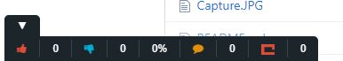

# DVO Toolbar

Like, dislike and comment on any URL.

The is extension uses GunDB and Solid. GunDB is P2P. When you comment on a URL, the actual comment is stored in your Personal Online Datastore (POD), and a reference to the comment is stored in Gun.

